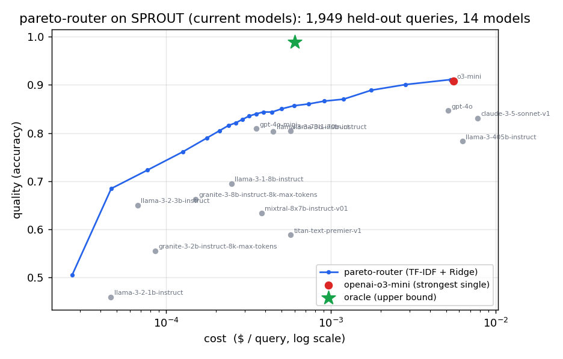

# pareto-router

**An LLM router: predict how well each model handles a query, then pick on the
cost-quality frontier.** Small, dependency-light, trained and benchmarked on real data.

On 10,950 held-out RouterBench queries across 11 models, a `pareto-router` trained with
TF-IDF and ridge regression:

- matches GPT-4's quality at 17% lower cost, and reaches 95% of GPT-4's quality at 80% lower cost;
- beats the best single model you can buy at any budget (+12.6 quality points at a $0.001/query budget);
- stays above all 11 individual models on the cost-quality frontier.



The blue line traces the router as you turn the cost/quality knob (`λ`). Each grey dot is
one model; the router runs above and to the left of all of them. The green star marks the
per-query oracle, the headroom a stronger featurizer can still reach (see
[Scope](#scope-and-honest-limitations)).

## Why this exists

LLM prices span two orders of magnitude, and no single model wins every query. On
RouterBench the strongest single model (GPT-4) averages 0.78 quality; sending each query
to its own best model averages 0.91. Route well and you capture much of that 0.13 gap at a
fraction of the cost.

The open-source options leave a hole:

- **LiteLLM** is a proxy. It hands you one API to 100+ models, but you still pick which to call.
- **RouteLLM** is research code for binary strong-vs-weak routing, and no one maintains it as a library.
- **vLLM-router** ties routing to serving infrastructure.

`pareto-router` fills the hole: a pip-installable routing-decision library that predicts
per-model quality and picks on the cost-quality frontier, with a RouterBench benchmark you
run yourself.

## Install

```bash
pip install pareto-router            # core: numpy + scikit-learn
pip install "pareto-router[bench]"   # + pandas, huggingface_hub  (to load RouterBench)
```

## Use

```python
from pareto_router import RouterModel, load_routerbench

data  = load_routerbench("0shot")        # downloads RouterBench (Hu et al., 2024)
model = RouterModel.fit(data)            # TF-IDF + multi-output ridge over the 11-model pool

decision = model.route("Prove the halting problem is undecidable.", lam=0.3)
print(decision.model, decision.predicted_quality)   # e.g. gpt-4-1106-preview 0.71
```

`lam` is the knob. Set it to 0 to always pick the highest predicted quality, 1 to always
pick the cheapest, or anything between to slide along the frontier.

```bash
pareto-router benchmark              # reproduce the RouterBench numbers below
pareto-router train  --out r.pkl     # train and save a router
pareto-router route  "..." --model r.pkl --lam 0.3
```

## How it works

1. **Featurize** the prompt. The default uses TF-IDF; you can drop in transformer
   embeddings through the `Featurizer` protocol.
2. **Predict** each model's quality with one multi-output ridge regression (`predictor.py`).
3. **Route** by maximizing `S = (1 − λ)·quality − λ·cost` over the pool. Cost is normalized
   to a fixed pool scale so `λ` lines up with the [0, 1] quality scale (`router.py`).
   `select_under_budget` does the same under a hard cost cap.

## The benchmark

`pareto-router benchmark` runs the whole thing on RouterBench. It splits the data
stratified by eval set, trains the predictor on the train half, and sweeps `λ` over the
held-out half against fixed reference points. The router decides from predicted quality on
queries it never saw; per-query cost is taken as known, which follows the standard
RouterBench scoring protocol (see [Scope](#scope-and-honest-limitations)).

```
RouterBench reproduction  |  train=25547  test=10950  models=11
strongest single model : gpt-4-1106-preview  quality=0.782  cost=$0.00330
match strongest quality: cost=$0.00274  (savings 16.8%)
match 95% of its quality: cost=$0.00064  (savings 80.5%)
frontier dominates     : 11/11 single models
frontier AUC (<= strongest cost): router=0.7569  single-model envelope=0.6526
oracle (upper bound)   : quality=0.910  cost=$0.00023

router vs best affordable single model, by budget:
  budget (xstrongest cost)  best single   router   advantage
  0.05                           0.549    0.668   +11.9 pts
  0.15                           0.646    0.724    +7.8 pts
  0.3                            0.646    0.772   +12.6 pts
  0.6                            0.646    0.778   +13.2 pts
  1.0                            0.782    0.785    +0.3 pts
```

Every number above comes from this library on the RouterBench 0-shot split, not from a
paper. Reproduce them with `pareto-router benchmark` (about 10 s on a laptop).

## What's faithful to the papers, and what's mine

| Component | Source | Fidelity |
| --- | --- | --- |
| Predict per-model quality, then route | RouteLLM (Ong et al., 2024) | Faithful to the paradigm |
| Cost-quality trade-off objective `S=(1−λ)Q−λC` | R2-Router (Xue et al., 2026) | Faithful to the general selection form |
| Evaluation on RouterBench | Hu et al., 2024 | The standard routing benchmark |
| TF-IDF + ridge quality predictor | mine | RouteLLM and R2-Router train text embeddings; this is the dependency-light baseline |
| Multi-model frontier + λ knob + budget mode | mine | RouteLLM routes binary strong/weak; this routes over the full pool |
| Length-budget-aware routing | R2-Router | Not implemented, see Scope |

## Scope and honest limitations

- **No length-budget routing yet.** R2-Router's headline idea also chooses an output-length
  budget per query. That needs per-length quality data (their R2-Bench, built on SPROUT with
  learned embeddings). RouterBench carries one quality and cost per query-model, so this
  library cannot evaluate length budgets honestly. It sits on the roadmap, out of the numbers
  above.
- **The predictor is a baseline.** TF-IDF and ridge stay light on purpose. The oracle reaches
  0.910 against the router's top of about 0.785; that gap is the headroom a stronger featurizer
  (a sentence-transformer, dropped in through the `Featurizer` protocol) would capture. One swap
  closes most of it.
- **Cost at decision time.** The benchmark uses RouterBench's recorded per-query cost. For live
  routing, `RouterModel.route` falls back to per-model mean cost unless you pass a real estimate.

## Module map

| Module | Responsibility |
| --- | --- |
| `data.py` | Load/parse RouterBench into quality + cost arrays |
| `features.py` | Featurizers (default TF-IDF; pluggable) |
| `predictor.py` | Multi-output quality regression |
| `router.py` | Cost-quality selection (`λ` trade-off + budget) |
| `metrics.py` | Frontier, cost-at-quality, AUC |
| `benchmark.py` | Train/test RouterBench evaluation |
| `model.py` | `RouterModel`: fit / route / save / load |

## Papers

- **RouterBench**, Hu et al., *A Benchmark for Multi-LLM Routing System*, [arXiv:2403.12031](https://arxiv.org/abs/2403.12031), 2024.
- **RouteLLM**, Ong et al., *Learning to Route LLMs with Preference Data*, [arXiv:2406.18665](https://arxiv.org/abs/2406.18665), 2024.
- **R2-Router**, Xue et al., *A New Paradigm for LLM Routing with Reasoning*, [arXiv:2602.02823](https://arxiv.org/abs/2602.02823), 2026.

## Status

v0.1.0. Tested, CI on Python 3.9 to 3.12, runs offline except for the RouterBench download.
Roadmap: a transformer-embedding featurizer, length-budget routing on per-length data, and
live provider adapters (OpenAI/Anthropic) with token-based cost estimation.

## License

MIT
